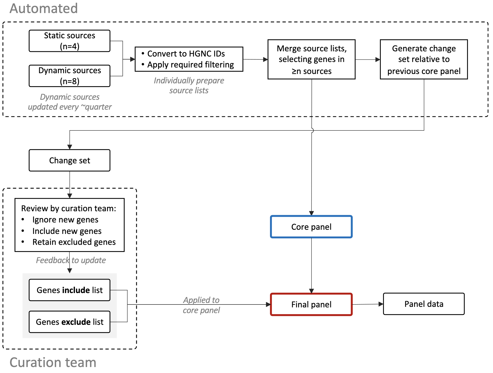

# Somatic panel

The UMCCR somatic gene panel is generated in two steps:

1. automated construction of the core panel from high-quality sources
2. inclusion or exclusion of new core panel entries through expert review by our curation team

Multiple sources are used to construct the core panel in order to capture as many potentially relevant genes as
reasonable and to avoid reliance on a single source that may become unmaintained in the future. Several eligible sources
were excluded due to incompatibile licensing or terms.

The second step is facilitated through maintainence of an [inclusion list](resources/curation_team/genes_include.tsv)
and [exclusion list](resources/curation_team/genes_exclude.tsv), which are updated in coordination with the curation
team following refresh of the core panel.

## Overview diagram

## Procedure

1. Review literature, community for new sources
  * Include new sources in `1_panel_sources/` if appropriate
2. Update data of dynamic sources in `1_panel_sources/sources_dynamic/`
3. Generate the core panel in `2_core_panel/`, ensuring to review existing filtering threshold
  * Create change set between new and existing core panel, provide to curation team for review
4. Update inclusion list and exclusion list with curation team feedback
5. Apply inclusion/exclusion lists in `3_final_panel/` to obtain final panel
6. Generate panel data files in `4_panel_data/`

## Multiple source note

Using multiple sources introduces bias since sources may be derived fully or partially from the same or similar resource
(e.g. COSMIC, ICGC, TCGA), impacting overall gene frequency distribution and consequently suppressing relative frequency
of genes not in commonly used resources. This is important as a selection threshold on the frequency of genes across
sources is applied. However, the effect of this bias is largely mitigated through inclusion of expert input from our
curation team via review and other recommendations.
